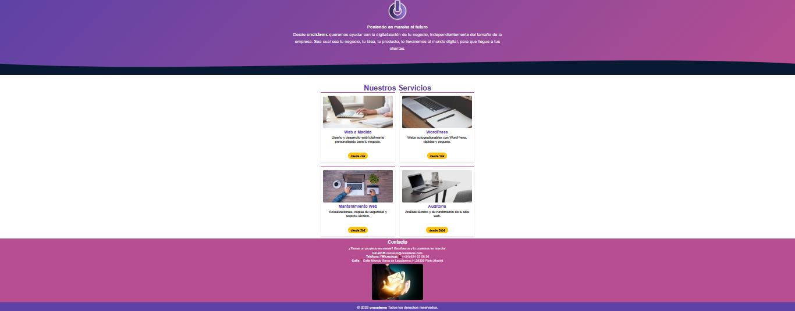

#  🌐 Proyecto Landing Page – onsistems

## 📌 ¿Qué es este proyecto?
En este proyecto he creado una lading page para la empresa onsistems.

La he desarrollado completamente desde cero, sin utilizar plantillas, con el objetivo de hacer una página sencilla donde se muestren los principales servicios de la empresa de forma clara y visual.

La idea es que cualquier persona que entre pueda entender rápidamente qué ofrece onsistems y acceder directamente a cada apartado de la web oficial.

## 🎯 ¿Qué hace esta página?
La página incluye:

* Un mensaje principal de presentacion.
* Logo de la empresa onsistems.
* Un apartado de servicios.
* Cuatro bloques con los servicios más importantes.
* Botones que llevan directamente a la web oficial.
* Una seccion de contacto con los datos de la empresa.
* Un pie de página.
* Apartado de los derechos reservados de onsistems.

Todo está organizado para que la navegación sea fácil y directa.

## 🛠 ¿Cómo lo he construido?
La página está formada por un archivo HTML y un archivo CSS.

He trabajado la estructura desde cero y he aplicado los colores corporativos de la empresa para mantener coherencia con su imagen.

Cada servicio tiene su propia imagen representativa y un botón que redirige a la sección correspondiente dentro de la página oficial de onsistems.

## 🖼️  Vista del Formulario

Así es como queda la landing:

## 💬 Mi experiencia haciendo este proyecto
Este a sido el proyecto donde más he trabajado la parte visual.

Al hacerlo desde cero, he tenido  que pensar cómo organizar los servicios para que quedaran equilibrados y cómo adaptar las imágenes para que no se descuadrara el diseño.

También me ha servido para entender mejor cómo construir una página completa partiendo de una idea simple y darle forma poco a poco.

Aunque es una landing sencilla, me ha ayudado a ganar seguridad trabajando con estructura y estilos.

## 👨‍💻 Autora
Noelia Parra Rodríguez.

Practicas en onsistems.
